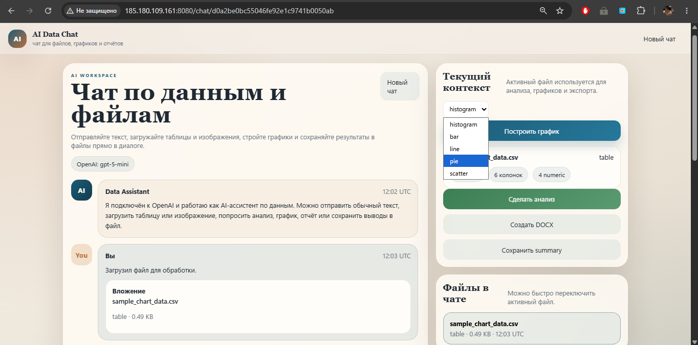
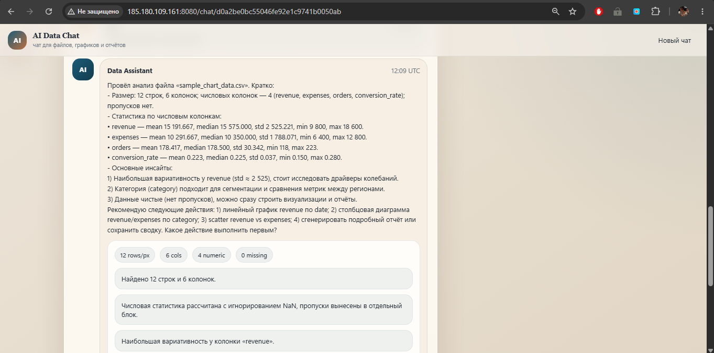
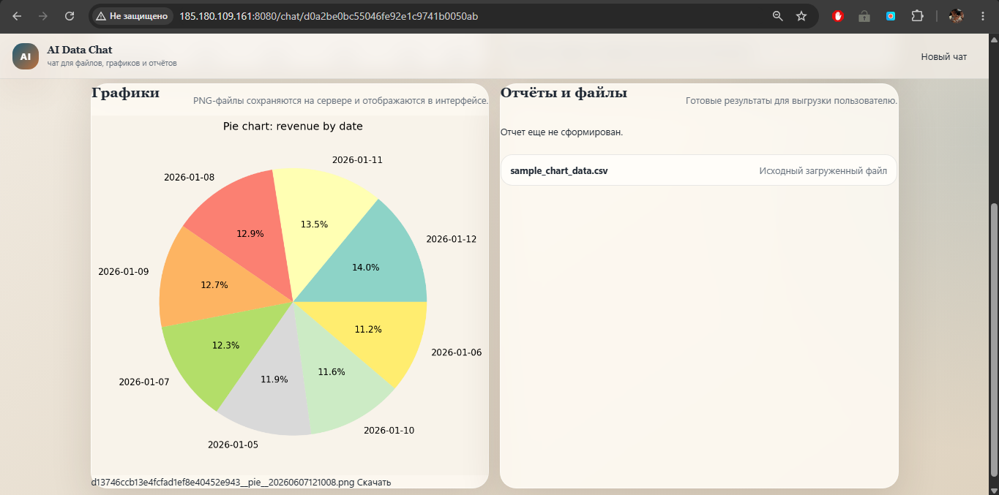

<div align="center">

# 🤖 Data Assistant — AI-ассистент для анализа данных

**[Открыть веб-приложение](http://185.180.109.161:8080/)**


**Умный чат-ассистент для работы с таблицами, графиками и отчётами**

[Описание](#-описание-проекта) • [Бизнес-цель](#-бизнес-цель) • [Технологии](#-технологии) • [Архитектура](#-архитектура) • [Скриншоты](#-скриншоты) • [Установка](#-установка-и-настройка) • [Структура](#-структура-проекта) • [Заключение](#-заключение) • [Лицензия](#-лицензия) • [Контакты](#-контакты)

</div>

---

## 📋 Описание проекта

**Data Assistant** — это fullstack-веб-приложение для автоматизации анализа данных и формирования отчётности. Ассистент объединяет чат-интерфейс с возможностью загрузки таблиц (CSV, Excel, JSON) и изображений, AI-анализом данных, построением графиков и экспортом результатов в различные форматы.

### Основные возможности

- 💬 **Чат-интерфейс** — общение с AI-ассистентом на естественном языке
- 📊 **Загрузка данных** — поддержка CSV, Excel, JSON и изображений
- 📈 **5 типов графиков** — `line`, `bar`, `histogram`, `pie` (круговая), `scatter` (диаграмма рассеяния)
- 📑 **Анализ данных** — автоматическая статистика, выявление инсайтов и аномалий
- 📄 **DOCX-отчёты** — генерация структурированных отчётов с графиками и анализом
- 📦 **Markdown-сводки** — экспорт результатов в markdown-формате
- 🔍 **Предпросмотр файлов** — мгновенный просмотр загруженных данных
- 🎯 **Активный файл** — контекстная работа с выбранным файлом

### Бизнес-цель

**Проблема:** Специалисты тратят значительное время на рутинные задачи анализа данных: построение графиков, создание отчётов, статистический анализ. Каждый инструмент требует отдельного обучения, а переключение между программами снижает продуктивность.

**Решение:** **Data Assistant** сокращает время на аналитические задачи с часов до минут за счёт единого чат-интерфейса, где можно:
- Загрузить файл и сразу получить анализ
- Попросить построить любой график в 1–2 сообщениях
- Экспортировать результаты в DOCX или markdown
- Работать с несколькими файлами в одном чате

**Целевая аудитория:**
- Владельцы бизнеса — быстрая аналитика продаж, финансов, KPI
- **Data Assistant** — ускорение рутинных задач, фокус на сложных вопросах
- Менеджеры проектов — отчёты и дашборды без Excel
- Все, кто работает с данными — от студентов до руководителей

---

## 🛠 Технологии

| Категория | Технологии |
|-----------|------------|
| **Язык программирования** | Python 3.11+ |
| **Backend API** | FastAPI 0.115+, Uvicorn, Pydantic v2 |
| **Frontend** | Jinja2 + HTMX (без JavaScript-фреймворков) |
| **LLM** | OpenAI GPT-4.1-mini (через ProxyAPI) |
| **Анализ данных** | pandas 2.2+, numpy 2.2+ |
| **Графики** | matplotlib 3.10+ |
| **Документы** | python-docx 1.1+, openpyxl 3.1+ |
| **Обработка файлов** | Pillow 11.1+ (изображения) |
| **Инфраструктура** | Docker, Docker Compose |

---

## 🏗 Архитектура

```
┌─────────────────────────────────────────────────────────────────┐
│                    Frontend (Jinja2 + HTMX)                     │
│   Загрузка файлов │ Чат │ Предпросмотр │ Графики │ Отчёты       │
└─────────────────────────────────────────────────────────────────┘
                              │
                              ▼
┌─────────────────────────────────────────────────────────────────┐
│                   Backend (FastAPI + Python 3.11)               │
│                                                                 │
│  ┌──────────────┐  ┌──────────────┐  ┌──────────────┐           │
│  │ Chat Service │  │ AI Service   │  │ File Service │           │
│  │ (сессии)     │  │ (LLM)        │  │ (загрузка)   │           │
│  └──────────────┘  └──────────────┘  └──────────────┘           │
│         │                 │                  │                  │
│         ▼                 ▼                  ▼                  │
│  ┌──────────────┐  ┌──────────────┐  ┌──────────────┐           │
│  │ Chart        │  │ Analysis     │  │ Report       │           │
│  │ Service      │  │ Service      │  │ Service      │           │
│  │ (matplotlib) │  │ (pandas)     │  │ (docx)       │           │
│  └──────────────┘  └──────────────┘  └──────────────┘           │
│                                                                 │
└─────────────────────────────────────────────────────────────────┘
                              │
        ┌─────────────────────┼─────────────────────┐
        ▼                     ▼                     ▼
┌───────────────┐    ┌───────────────┐    ┌───────────────┐
│  File Storage │    │  Chat JSON    │    │  Artifacts    │
│  (uploads/)   │    │  (chats/)     │    │  (outputs/)   │
└───────────────┘    └───────────────┘    └───────────────┘
```

> **Примечание:** Графики строятся **локально** через Python/matplotlib, а не генерируются LLM. LLM только рекомендует, какой график построить.

---

## 📸 Скриншоты

### Чат с загруженным файлом и выбор типа графика



### Пример анализа файла



### Результат — график в чате



---

## 🚀 Установка и настройка

### Предварительные требования
chart_result.png
- Python 3.11+
- Docker Desktop (опционально)
- API-ключ OpenAI (или прокси-сервер)

### Клонирование репозитория

```bash
git clone <repository-url>
cd ai-data-assistant
```

### Создание виртуального окружения

```bash
# Windows
python -m venv .venv
.venv\Scripts\activate

# Linux/macOS
python -m venv .venv
source .venv/bin/activate
```

### Установка зависимостей

```bash
pip install -r requirements.txt
```

### Настройка переменных окружения

Создайте файл `.env` в корне проекта:

```bash
# Windows
copy .env.example .env

# Linux/macOS
cp .env.example .env
```

Отредактируйте `.env`, внеся свои ключи

> **Важно:** `OPENAI_BASE_URL` указывает на прокси-сервер OpenAI API. Используйте свой прокси или прямой доступ к OpenAI.

### Запуск через venv

```bash
# Windows
.venv\Scripts\activate
uvicorn app.main:app --reload --host 0.0.0.0 --port 8080

# Linux/macOS
source .venv/bin/activate
uvicorn app.main:app --reload --host 0.0.0.0 --port 8080
```

Приложение: http://localhost:8080

### Запуск через Docker

```bash
docker-compose up --build -d
```

Остановить:
```bash
docker-compose down
```

Проверить логи:
```bash
docker-compose logs -f
```

---

## 📁 Структура проекта

```
ai-data-assistant/
├── app/
│   ├── core/                      # Конфигурация и системные модули
│   │   ├── config.py              # Pydantic Settings (.env)
│   │   ├── logging.py             # Настройка логирования
│   │   └── __init__.py
│   │
│   ├── routes/                    # HTTP маршруты
│   │   ├── pages.py               # Рендеринг страниц
│   │   ├── upload.py              # Загрузка файлов
│   │   ├── chat.py                # Чат и активация файлов
│   │   ├── actions.py             # Прямые действия (графики, анализ)
│   │   └── __init__.py
│   │
│   ├── services/                  # Бизнес-логика
│   │   ├── chat_service.py        # Управление сессиями чата
│   │   ├── ai_service.py          # Работа с OpenAI API
│   │   ├── file_service.py        # Загрузка и валидация файлов
│   │   ├── chart_service.py       # Построение графиков
│   │   ├── analysis_service.py    # Анализ данных (pandas)
│   │   ├── report_service.py      # Генерация DOCX-отчётов
│   │   ├── export_service.py      # Экспорт в markdown/JSON
│   │   └── __init__.py
│   │
│   └── main.py                    # Точка входа FastAPI
│
├── static/                        # Статические файлы
│   ├── css/
│   │   └── styles.css             # Стили приложения
│   └── js/
│       └── app.js                 # JavaScript (минимальный)
│
├── templates/                     # HTML шаблоны
│   ├── base.html                  # Базовый шаблон
│   ├── index.html                 # Главная страница
│   ├── chat.html                  # Страница чата
│   ├── preview.html               # Предпросмотр файла
│   └── partials/                  # Частичные шаблоны (HTMX)
│       ├── index_content.html
│       ├── chat_shell.html
│       ├── preview_content.html
│       ├── result_panel.html
│       └── result_page_content.html
│
├── storage/                       # Хранилище данных
│   ├── uploads/                   # Загруженные файлы
│   ├── outputs/                   # Артефакты (графики, отчёты)
│   └── chats/                     # JSON-файлы сессий чата
│
├── examples/                      # Примеры данных
│   ├── sample_sales.csv
│   └── sample_chart_data.csv
│
├── .env.example                   # Шаблон .env
├── .dockerignore
├── .gitignore
├── docker-compose.yml             # Docker Compose конфиг
├── Dockerfile                     # Docker образ
├── requirements.txt               # Зависимости Python
└── README.md                      # Документация
```

---

## 🔧 Детальное описание компонентов

### Ядро системы (Core)

**Config** (`app/core/config.py`)
- Dataclass `Settings` для управления переменными окружения
- Валидация через Pydantic
- Централизованная конфигурация для всего приложения

**Logging** (`app/core/logging.py`)
- Настройка структурированного логирования
- Управление уровнем детализации (DEBUG/INFO/WARNING/ERROR)

### Сервисный слой (Services)

| Сервис | Ответственность |
|--------|-----------------|
| **ChatService** | Управление сессиями чата, обработка сообщений, координация действий |
| **AIService** | Отправка запросов к OpenAI, парсинг ответов, fallback-режимы |
| **FileService** | Загрузка, валидация и хранение файлов (CSV, Excel, JSON, изображения) |
| **ChartService** | Построение графиков (line, bar, histogram, pie, scatter) через matplotlib |
| **AnalysisService** | Статистический анализ данных через pandas |
| **ReportService** | Генерация DOCX-отчётов с графиками и анализом |
| **ExportService** | Экспорт результатов в markdown, JSON |

### Маршруты (Routes)

| Маршрут | Описание |
|---------|----------|
| `/` | Главная страница (загрузка файла) |
| `/upload` | Обработка загрузки файлов |
| `/preview/{file_id}` | Предпросмотр файла |
| `/chat/{conversation_id}` | Страница чата |
| `/chat/{id}/message` | Отправка сообщения в чат |
| `/chat/{id}/activate/{file_id}` | Активация файла в чате |
| `/actions/chart/{file_id}` | Построение графика напрямую |
| `/actions/analyze/{file_id}` | Анализ напрямую |

### Хранение данных

**File-based persistence**
- Сессии чата сохраняются в `storage/chats/{conversation_id}.json`
- Загруженные файлы: `storage/uploads/{file_id}`
- Артефакты (графики, отчёты): `storage/outputs/{artifact_id}`

---

## 🎯 Заключение

**Data Assistant** — это готовое к production решение для автоматизации аналитических задач. Приложение объединяет чат-интерфейс, AI-анализ данных, построение графиков и экспорт результатов в едином интерфейсе.

**Ключевые особенности:**
- Сокращение времени на рутинные аналитические задачи с часов до минут
- Поддержка 5 типов графиков: line, bar, histogram, pie, scatter
- Гибкая архитектура — легко адаптировать под конкретные задачи через промпт
- File-based persistence — нет необходимости в базе данных
- Docker-контейнеризация — простой деплой на любой сервер

**Гибкость решения:**
Благодаря широкому промпту, заложенному в основу, ассистент не ограничивается узкой задачей вроде построения графиков, а охватывает множество аспектов анализа данных. При необходимости его можно легко адаптировать под конкретную задачу — достаточно доработать промпт в `ai_service.py`.

---

## 📄 Лицензия

MIT License — подробности в файле [LICENSE](LICENSE)

---

## 📞 Контакты

**Автор:** Ivan P  
**Telegram:** [@nonoyessure](https://t.me/nonoyessure)  

---

<div align="center">

**⭐ Ставьте звезду, если проект полезен!**

🚀

</div>
